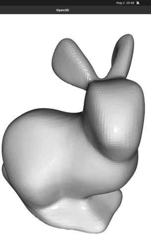
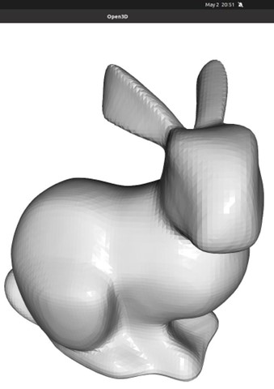
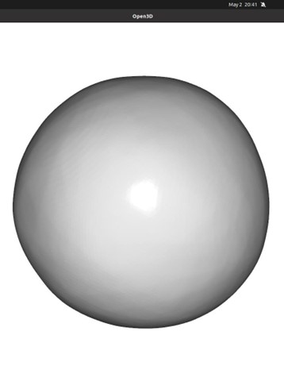

# DeepSDF-Based Neural Implicit Surface Reconstruction

## Project Overview

This repository contains the implementation of a neural implicit surface reconstruction model based on the DeepSDF architecture (CVPR 2019 [^1]). The model, model.py, is a multi-layer fully-connected neural network that learns to approximate Signed Distance Functions (SDFs) from 3D point samples and their SDF values. The architecture involves 8 fully-connected layers with a unique concatenation mechanism after the fourth layer. The training procedure (train.py) minimizes the clamped L1 loss between predicted and actual SDF values of sample points. The utils.py script is responsible for sampling training points and their SDF values.


[^1]: Park, Jeong Joon, Peter Florence, Julian Straub, Richard Newcombe, and Steven Lovegrove. "Deepsdf: Learning continuous signed distance functions for shape representation." In Proceedings of the IEEE/CVF Conference on Computer Vision and Pattern Recognition, pp. 165-174. 2019.


## Repository Structure

- `checkpoints/`: Stores trained model checkpoints.
- `data/`: Dataset directory.
- `images/`: Stores result images for the README file.
- `model.py`: Neural network architecture.
- `train.py`: Training procedure implementation.
- `utils.py`: Utility functions for training point sampling.

## Instructions

### Requirements

- python 3.10
- torch 2.1.2
- numpy 1.26.2
- open3d 0.17.0
- scikit-image 0.20.0

### Installation

Create a new conda environment and install the required packages:
```bash
conda create -n deepsdf_env python=3.10
conda activate deepsdf_env
```

Clone the repository:

```bash
git clone https://github.com/meysam-safarzadeh/surface_reconstruction_from_PointCloud.git
cd surface_reconstruction_from_PointCloud/
pip install -r requirements.txt
```


### Basic Usage

To start training with default settings, simply run:

```bash
python train.py
```

### Using `train.py`

The `train.py` script facilitates training the DeepSDF-based neural implicit surface reconstruction model and offers various command-line options for customization.

### Command-Line Arguments

- `-e`, `--evaluate`: Enter test mode to evaluate the model on the validation/test set (no training).
- `--input_pts`: Path to the input point cloud file (default: `data/bunny-1000.pts`).
- `--checkpoint_folder`: Directory to save model checkpoints (default: `checkpoints/`).
- `--resume_file`: File path for resuming training from the latest checkpoint (default: `model_best.pth.tar`).
- `--weight_decay`: Set weight decay/L2 regularization on weights (default: 1e-4).
- `--lr`: Initial learning rate (default: 1e-4).
- `--schedule`: Epoch milestones for learning rate adjustment (default: `[40, 50]`).
- `--gamma`: Factor for learning rate decay (default: 0.1).
- `--start_epoch`: Starting epoch number for training (default: 0).
- `--epochs`: Total number of training epochs (default: 100).
- `--train_batch`: Batch size for training (default: 512).
- `--train_split_ratio`: Proportion of data used for training (default: 0.8).
- `--N_samples`: Number of samples per input point (default: 100).
- `--sample_std`: Standard deviation for Gaussian noise in point sampling (default: 0.05).
- `--clamping_distance`: Clamping distance used in SDF calculation (default: 0.1).
- `--test_batch`: Batch size for testing (default: 2048).
- `--grid_N`: Size of the 3D grid containing the point cloud for evaluation (default: 128).
- `--max_xyz`: Maximum xyz coordinate values (default: 1.0).

### Example Usage

To begin training with specific parameters, you can use a command like:

```bash
python train.py --input_pts data/sphere.pts --lr 0.0001
```

## Implementation Overview

### Architecture

The network architecture features eight fully-connected layers. Each hidden layer maintains a vector representation of size 512. A unique aspect of this architecture is the processing after the fourth fully-connected (FC) layer:

- The output of the fourth FC layer is a 509-dimensional vector.
- This vector is concatenated with the original 3D point coordinates (x, y, z), forming a 512-dimensional vector.

The first seven FC layers (excluding the last one) have the following components:

- Weight normalization layer.
- PReLU non-linear activation layer with a common learnable slope across all channels.
- Dropout layer with a dropout rate of 0.1.

The final output, representing the predicted SDF value, is obtained through:

- The last FC layer, transforming the vector dimension from 512 to 1.
- A tanh activation layer.

### Training Procedure

The training procedure is implemented in `train.py` and involves:

- Minimizing the sum of losses between predicted and real SDF values of sample points.
- Using the clamped L1 loss function with σ=0.1.

The AdamW optimizer is employed with:

- Default learning rate: 0.0001
- Weight decay: 0.0001

The network undergoes training over 100 epochs with a batch size of 512. Loss metrics for both the training and validation sets are reported per epoch. The model with the lowest loss on the validation set is saved as the best model.

### Sampling Methodology

Implemented in `utils.py`, the sampling of training points and their SDF values is crucial for the training process. The methodology involves:

- Sampling training 3D points around the given surface points of the point cloud.
- Sampling is done along the normal directions of the surface points.

## Results

The implementation successfully reconstructs various 3D shapes, as demonstrated in the figures below:

- Figure 1: Reconstructed Bunny 500

  


- Figure 2: Reconstructed Bunny 1000

  

  
- Figure 3: Reconstructed Sphere

  


## References

- Park, J. J., Florence, P., Straub, J., Newcombe, R., & Lovegrove, S. (2019). Deepsdf: Learning continuous signed distance functions for shape representation. In Proceedings of the IEEE/CVF Conference on Computer Vision and Pattern Recognition (pp. 165-174).

